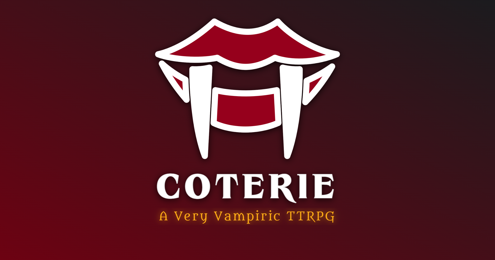

  

# *Coterie*

***A free, sandboxy, street-level vampire TTRPG. Roll dice, pretend to bite people, deal with consequences.***

**Read the full rules at [coterie.zip](https://coterie.zip)**!

---

***Coterie*** is a tabletop RPG built on the *Powered by the Apocalypse* framework, drawing heavily from *Vampire: The Masquerade V5* (and some *V20*), *Urban Shadows 2e*, *Blades in the Dark*, and *Monster of the Week*. It's designed to be easy to learn, easy to run, and easy to play, whether you're a seasoned *VTM* veteran or someone who just thinks vampires are neat.

The game keeps its focus tight: small groups of vampires navigating the dusk-to-dawn hours of everynight unlife. No grand political machinations, no centuries-spanning conspiracies... just personal horror, messy drama, and the eternal question: *what do y'all wanna do tonight?*

It's also completely free, so if you somehow paid for this, you got scammed. If you really like it, though, fiscally responsible tips & donations are gladly accepted at my [Ko-fi](https://ko-fi.com/xyagain). Thanks so much, and I hope you have fun!

♥, *Sam*

## At a Glance

- **PbtA Bones, VTM Fangs:** Fiction-first Moves and Playbooks with a chilled-out version of *Vampire: The Masquerade*'s Clans, Disciplines, Hunger, and Humanity systems
- **Medium Crunchiness, Mild Lore:** ***Coterie*** does its best to strike a balance between the free-flowing fiction of *PbtA* and the excellent vampiric archetypes that VTM is known for but without all the dots and dice pools and messy stuff that can really make things drag. It's pretty snappy!
- **21 Playbooks (for now):** 14 Clan and 7 Clanless, each with unique Perks, Compulsions, and Banes
- **16 Disciplines:** Vampiric powers adapted from *VTM*, with a streamlined Power/Perk system
- **5 Character Stats:** Blood, Shadow, Resolve, Demeanor, & Wits — nice & easy!
- **5 Coterie Stats:** Your group has its own stats, Moves, and identity
- **Build-a-Vamp Character Crafter (COMING SOON):** Built-in guided character creation & sheet management, with an export/import feature so you can use whatever format you prefer!
- **Terminology Toggle:** The site can swap all the *VTM* jargon for plain-language equivalents, so nobody needs to know what a "Nosferatu" is to play (but c'mon, just *look* at the word)
- **4–7 players:** One Storyteller, the rest playing vamps until something dreadful happens to them!

## Feedback

Got thoughts, suggestions, balance changes, or site bugs to report? Open an [Issue](../../issues) — all feedback is welcome! Hit me! Or I guess actually roll +Blood to see if **Dirty Your Claws**.

## Under the Coffin Lid

The site is built with [Zensical](https://zensical.org/) and hosted on GitHub Pages. All fonts are self-hosted (no trackers). The Gothic Vampire theme, terminology toggle, and all the other weird little touches are custom CSS and JavaScript.

## The Boring Stuff

> This is an unofficial, non-commercial fan project. It is not affiliated with or endorsed by Paradox Interactive.
>
> Portions of the materials are the copyrights and trademarks of Paradox Interactive AB, and are used with permission. All rights reserved. For more information please visit [worldofdarkness.com](https://www.worldofdarkness.com).
>
> *Vampire: The Masquerade* is a trademark of Paradox Interactive AB. This project operates under the [Dark Pack Agreement](https://www.paradoxinteractive.com/games/world-of-darkness/community/dark-pack-agreement).
>
> *Powered by the Apocalypse* framework by D. Vincent Baker and Meguey Baker. ***Coterie*** is not affiliated with the creators of PbtA, but I'm a huge fan and I love their work! Thanks so much!
>
> Site theme based on [Zensical](https://zensical.org/) by Martin Donath (MIT License). Fonts used under the SIL Open Font License. The animation sprites for the adorable little bat buddy are from [ggoolmool on Itch.io](https://ggoolmool.itch.io)!
