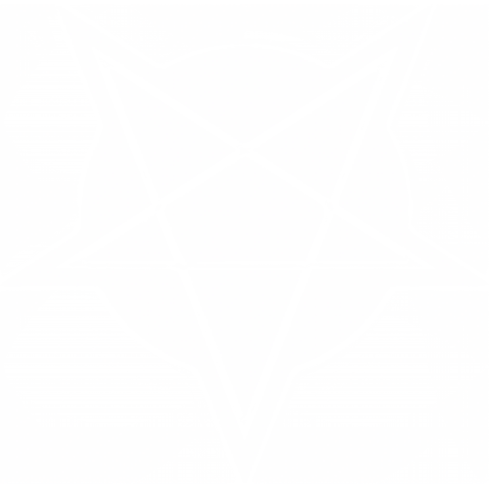

*The greatest lie is the one we tell ourselves.*

## What Are You?

{ .bloodline-symbol }

Nobody knows you're here. That's the entire point. You are Baali, a Devil, a vampire whose blood carries something older and nastier than the standard curse. Maybe your sire found you, saw the darkness you were already flirting with, and decided to give it teeth. Maybe you were Kindred of another Clan first, and a ritual called Apostasy re-Embraced you with infernal blood, filling in the hollow places of your soul with something from the Outer Dark — the domain farthest from reality that is, to others, only rumor. However it happened, you woke up damned in a way that other Kindred can't fully appreciate, connected to dreaming things beyond creation that whisper when you listen and scream when you don't. Your kind insists on being called a Clan. Everyone else calls you a corruption, a myth, or a problem to be solved with fire. You don't argue. Arguing draws attention, and attention kills.

You carry Daimonion, an exclusive and ever-evolving connection to the Outer Dark that grows stronger as your Humanity erodes. The deeper you descend, the more the demons notice you, and the more power they offer in return. You can also wield Blood Sorcery, Oblivion, or Presence, depending on your inclinations. The twin paths of Blood and Shadow that the Baali have practiced since before those arts had names, or the social magnetism that has kept your kind surviving in cities full of enemies for millennia. Your Coterie (or Nest) tolerates or even welcomes you because you solve problems nobody else can. You procure impossible things, broker deals with terms that seem too good to be true (because they are), and channel power from a source that most Kindred are too afraid to acknowledge exists. A desperate Coterie rarely questions how their associate manages to get a 55-gallon industrial barrel of virgin blood to pay off their Debts when the alternative would have been Final Death for the lot. You make yourself dependable, approachable, and useful, and your infernal ties go unconsciously ignored or consciously excused.

The cost is the tightrope you walk between three different kinds of ruin. Holy symbols burn you, church bells shake you to the bone, and blessed water sears your flesh, just like the vampyr from the old mortal stories. You always owe the Outer Dark a little piece of your soul, a transgressive act called the *Dark Sacrament* that feeds the things that fuel you; skip it, and your powers falter as the infernal blood rebels against you. And underneath all of it, the lie: you are pretending to be someone else every single night. Tremere, Lasombra, Banu Haqim, The Ministry, whatever Clan you have best learned to mimic. If the wrong individual discovers what you really are, the response is not politics or censure or a fair trial, it is a Blood Hunt; a rare united front of every Kindred in the domain turning their fangs on you. If history has taught vampires one thing about the Baali, it's that the only safe Devil is a dead one.

## Disciplines

You start with exclusive access to [**Daimonion**](../disciplines/daimonion.md). Choose 1 additional: [**Blood Sorcery**](../disciplines/blood-sorcery.md) **| [Oblivion](../disciplines/oblivion.md) | [Presence](../disciplines/presence.md)**

Daimonion does not follow normal Discipline access rules. Instead of requiring Blood Potency, each Daimonion Power requires your **Humanity to be at or below a threshold** to learn and use. If your Humanity rises above a Power's threshold, you lose access to it until your Humanity drops again.

- Level 1 requires 6 or lower Humanity
- Level 2 requires 5 or lower
- Level 3 requires 4 or lower
- Level 4 requires 3 or lower
- Level 5 requires 2 or lower (yikes)

## Bane: *Infernal Infiltration*

You carry three curses woven into your infernal blood, each pulling you in a different direction:

*Holy Repulsion.* You automatically receive three mandatory [Folkloric Banes](optional-extras.md#folkloric-banes) at character creation: *Holy Water*, *Ding-Dong Don't*, and *Holy Symbols*. These grant only half their normal XP (+3 XP total instead of +6).

*Eternal Sacrifice.* **Once per session, you may voluntarily mark a Stain to sustain your connection to the Outer Dark.** This is both your burden and your fuel (see the ***Dark Sacrament*** Perk below). **If you skip the Sacrament**, the demonic Vitae in your veins grows restless: whenever a Hunger Check is called for, you must make 1 additional Hunger Check on top of whatever was already required. This penalty persists until you perform a Sacrament, Dark or otherwise.

*Adaptive Identity.* You must pass yourself off as a member of another Clan to survive under the rule of any vampiric sect. Being identified as Baali is, in most domains, a death sentence. If your true nature is exposed to Kindred who know what it means, the Storyteller determines the consequences; expect a Blood Hunt, exile, or something much worse. The ***Hidden Devil*** Perk provides supernatural cover for your blood, but maintaining social cover through behavior, relationships, and convincing lies is entirely on you.

## Compulsion: *Devil's Bargain*

**When the Outer Dark stirs and you refuse its demands that night**, take an Ongoing penalty equal to half your missing Humanity (rounded up, minimum 1) to all rolls. Your missing Humanity is 10 minus your current Humanity (at 7 Humanity, that's −2; at 3 Humanity, that's −4).

**On any roll of 6-**, you may choose to upgrade the result to a 7–9 instead. The success manifests with overtly demonic interference. The Storyteller chooses 1 infernal complication in addition to the normal one:

- The environment reacts unnaturally; lights flicker and die, temperature drops, plants wither, electronics shriek or go haywire, water boils or freezes instantly, gravel or pebbles tremble in fear
- At least one innocent bystander is visibly and suddenly affected; a really bad nosebleed, struck with terror, persistent fainting, whispering in a language nobody recognizes, eyes go all-black or red
- Your shadow noticeably does something it ought not to without your consent; moves on its own, gestures independently, grows too large for the light source, or deals 1 Superficial Harm to whoever is unlucky enough to be closest to you by slicing them open just a little bit
- One or more animals in the vicinity panics, flees, attacks someone nearby, or drops dead for no visible reason; the more loved and appreciated an animal is, the higher the likelihood of this effect
- Something nearby warps or corrupts; food spoils instantly, water turns acrid and stagnant, glass cracks in mesmerizing spiral patterns, paint blisters off the walls like pustules, statues weep blood

The Compulsion ends after the demonic bailout resolves. These complications are unsettling and leave evidence, but are not automatic Masquerade breaches on their own.

## Baali Perks

You get 3 unique abilities:

***Hidden Devil:*** Your Vitae can appear to most as if it belongs to another, less universally-feared bloodline. Choose a [cover Clan](creating-your-character.md#discipline-overview) at character creation. **When someone uses Auspex, Blood Sorcery diagnostics, or any other supernatural method of identifying your bloodline**, they read you as your cover Clan unless the investigator rolls 12+ on their check for an ability strong enough to break such diabolical disguises. You may change your cover Clan with a night of unbroken focus after **Feeding** to satiation at least once.

***Pithos:*** **When someone sincerely asks you to help them to change,** you can grant them one Merit or remove one Flaw of their choice (from the main [Merits & Flaws](optional-extras.md#merits-flaws) list; Predator Type Merits/Flaws are excluded) through an infernal bargain. They also gain a [Dark Bargain](optional-extras.md#dark-bargains) of your choice (any they qualify for except *Monstrous Reflection*) and owe you a Debt. When this Debt is created, start a 6-segment Corruption Clock. The Clock advances 1 segment for every month of in-game time that the Debt remains unpaid. You can maintain a number of active Corruption Clocks equal to half your missing Humanity (rounded up, minimum 1). Other player characters may only be targeted with explicit player consent (an out-of-fiction conversation, not just in-character agreement).

- **At 2 segments:** The corrupted character gains a free Level 1 Daimonion Power of their choice. They need not ask for this, it simply trickles into their Blood one night when they need it most.
- **At 4 segments:** The corrupted character gains a free Level 2 Daimonion Power of their choice.
- **At 6 segments:** The corruption reaches critical mass. The corrupted character must choose one of three outcomes:
    - **Apostasy** (they are re-Embraced as Baali, retire their current Playbook, and adopt this one; see below)
    - **Sacrifice** (they are consumed as part of your next ***Dark Sacrament***, a Diablerie that feeds both you and the Outer Dark; you have Advantage on all Hunger Checks to Diablerize them)
    - **Trial by Balefire** (ritualistic one-on-one combat with you to scrub the Debt and the Corruption Clock entirely — if they win, they're free, fair and square; if they lose, the Storyteller determines the fallout, but you're probably getting a snack)

***Dark Sacrament:*** **When you maintain your connection to the Outer Dark by voluntarily marking a Stain** (as described in your Bane), choose a dedication:

- **Outer Dark:** Gain a number of free Daimonion Power uses (no Hunger Checks or gain required) equal to 1 + your Blood Potency for the night.
- **The Beast:** Gain a number of free Blood Surges equal to 1 + your Blood Potency for the night.
- **Your Coterie:** You gain nothing personally. Each member of your Coterie may remove the Hunger cost from a single Discipline Power use that night (they choose when to use this).

## Baali Experience

Once each per session, gain +1 XP when you...

- **Corrupt, tempt, or manipulate someone** into acting against their own interests or morals
- **Suffer meaningful consequences from your infernal nature** at a moment when they cost you something real
- **Maintain your cover identity** in a situation where exposure would have been catastrophic

### *If Someone Undergoes Apostasy*

Should the fiction lead to a Corruption Clock reaching 6 segments and the corrupted character choosing Apostasy, they undergo the Dark Apostasy: a re-Embrace that taints their blood with that of your demonic patron as per your Archetype. This is not a gentle or pleasant process, nor is it an exact science. Work with your Storyteller and the player of the corrupted character to determine how their conversion goes.

When the Dark Apostasy is complete, they retire their current Playbook and adopt this one. They keep their Bane, Convictions, Touchstones, and any Debts. Their stat array remains what it was but the bonuses may be reassigned at will. All XP carries over and may be reassigned.

They gain access to Daimonion and choose one of the three starter Disciplines (Blood Sorcery, Oblivion, or Presence), keeping one non-exclusive Discipline from their former Playbook as well. Of course, they also inherit the *Infernal Infiltration* Bane (with no consolation XP for Apostates; they already got what they wanted) on top of whatever Bane(s) they previously suffered from.

Welcome to the Outer Dark. It's been expecting you.

## Archetypes

- **Molochim:** *You are a grim custodian, keeping balance by placating what sleeps beneath & beyond.*
    - Blood −1 | Shadow +1 | Resolve +1 | Demeanor +2 | Wits +0
- **Nergali:** *You seek your own demonic ascendance by waking the monsters with the scent of carnage.*
    - Blood +2 | Shadow +0 | Resolve +1 | Demeanor −1 | Wits +1
- **Unknowable:** *You are a confusion amongst the confounding. Who or what calls to you, and why?*
    - Blood +0 | Shadow +2 | Resolve −1 | Demeanor +1 | Wits +1
- **Custom Archetype:** Create your own by distributing these stats: **+2 | +1 | +1 | +0 | −1**
